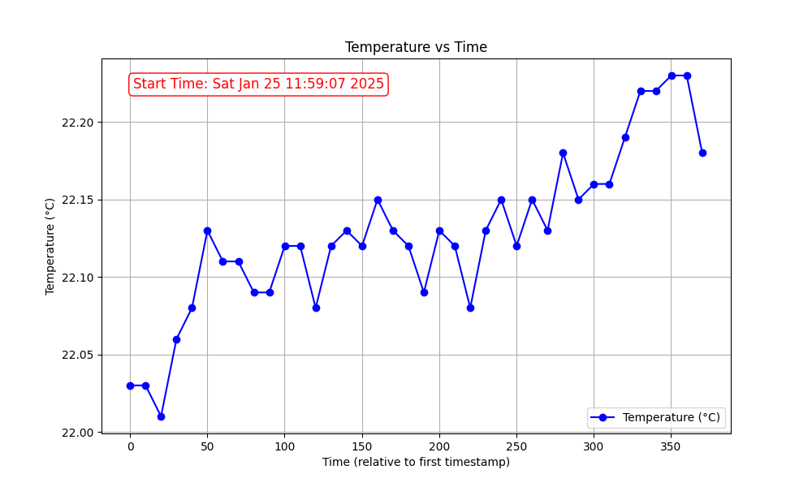

# BLE Temperature Sensor Data Collection and Visualization Tool

This project is a tool to collect temperature data from a BLE (Bluetooth Low Energy) temperature sensor, save the data to a CSV file, and visualize the temperature data over time using a graph. If no data is received from the sensor within a specified time period, the connection will automatically be disconnected.

## Key Features

- **BLE Temperature Sensor Connection**: Receive temperature data from devices like the `Pico` and other BLE-compatible devices.
- **Data Saving**: Save the received temperature data along with the timestamp to a CSV file.
- **Data Visualization**: Visualize the collected temperature data over time using a graph.
- **Inactivity Timeout**: Automatically disconnect if no notifications are received for a specified duration.

## Required Libraries

- `asyncio`: For asynchronous programming.
- `bleak`: Library to handle BLE communication.
- `struct`: To interpret byte data.
- `time`: For timestamp handling.
- `csv`: For saving data to CSV files.
- `matplotlib`: A library for graphing and visualizing data.

## Project Overview

This program connects to a specified BLE device (like a `Pico`) to receive temperature data and saves the data along with timestamps into a CSV file. The collected data can then be visualized using `matplotlib` to generate a graph of temperature changes over time. When the program ends, it saves the data and generates a graph of the temperature readings.

### Main Flow

1. **Device Scan**: Use a BLE scanner to search for available devices.
2. **Temperature Data Retrieval**: Receive temperature data from the BLE device through the temperature characteristic.
3. **Data Saving**: Save the received temperature data and timestamp to a CSV file.
4. **Data Visualization**: Create a graph of temperature vs time from the collected data.
5. **Inactivity Timeout**: Disconnect automatically if no notifications are received for a specified period.

## Setup Instructions

### Required Tools

- Python 3.x
- The following libraries must be installed:
  ```bash
  pip install bleak matplotlib
  ```

### Setting Up the Program

1. Clone or download the project files from GitHub.
   ```bash
   git clone https://github.com/kuronyan-sleep/pyble_temp_receiver.git
   cd pyble_temp_receiver
   ```

2. Install the required dependencies:
   ```bash
   pip install bleak matplotlib
   ```

## Usage

1. Before running the program, prepare your BLE-compatible temperature sensor (e.g., Raspberry Pi Pico W) and ensure it is properly configured.

2. Run the program:
   ```bash
   python pc_ble_temp_rx_c_g.py
   ```

3. The program will automatically scan for BLE devices, connect to a temperature sensor (e.g., starting with "Pico"), and start receiving temperature data. The data will be saved to a CSV file, and notifications will be sent periodically.

4. Once the program finishes, the collected temperature data will be saved to the `temperature_data.csv` file, and a graph of the temperature over time will be generated and saved as `temperature_plot.png`.

## CSV Data

The collected temperature data is saved in the `temperature_data.csv` file. The format is as follows:

```
Timestamp, Temperature (°C)
Sun Jan 25 14:12:35 2025, 23.45
Sun Jan 25 14:13:35 2025, 23.47
...
```

## Data Visualization

After the program finishes, an image file called `temperature_plot.png` will be created. This file contains a graph showing how temperature changes over time. Here is an example of what the graph looks like.

### Graph

- X-axis: Time (relative to the first timestamp)
- Y-axis: Temperature (°C)



## Error Handling

- **Inactivity Timeout**: If no notifications are received for a specified period (`INACTIVITY_TIMEOUT`), the program will automatically disconnect.
- **Program Interruption**: If the program is interrupted by `Ctrl+C`, it will save the collected data to the CSV file before exiting.

## Notes

- Temperature data is received in hundredths of a degree Celsius, so the program scales it accordingly.
- If `matplotlib` is not installed, the graphing part will be skipped, but the data will still be saved to the CSV file.

## License

This project is licensed under the MIT License. See the `LICENSE` file for more details.
